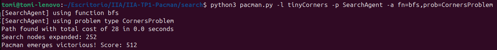
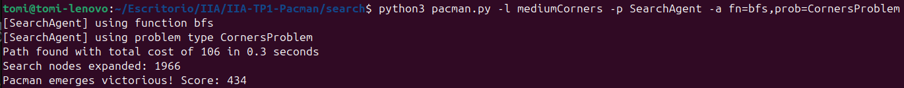
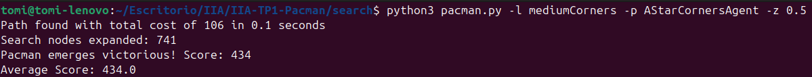

habría que explicar más o menos qué solución dimos y qué resultados obtuvimos

# Ejercicio 1

El algoritmo DFS busca los nodos más profundos del árbol de búsqueda sin expandir nodos ya visitados a partir de una instancia del problema de búsqueda.

Nuestra implementación lleva una **pila** de direcciones (el camino recorrido), una **pila** que contiene los nodos próximos a visitar (los sucesores de los nodos que visita) y un conjunto de estados ya visitados.

Siguiendo el algoritmo de búsqueda general, cuando visitamos un nodo chequeamos si es meta, en cuyo caso retornamos la lista de direcciones acumuladas. En caso contrario apilamos sus sucesores no visitados en la pila de nodos a visitar (es decir, los visitamos primero). Cada nodo recorrido es agregado al conjunto de nodos visitados y la dirección tomada para llegar a él es agregada a la pila del path. Cuando retrocedemos en el árbol (porque el camino tomado no nos lleva a nada) desapilamos tantas direcciones como diferencia haya entre el nivel del nodo actual y el tamaño de la pila, ya que el camino tiene exactamente un nodo por cada nivel. Por ejemplo, si llegamos al nivel 4 del árbol, la pila del path podría verse así:

path = ['N', 'N', 'E', 'S']

Si el siguiente nodo visitado es un nodo de nivel 2, ahora el path será:

path = ['N']

es decir, borramos el camino recorrido hasta volver al nivel 2, donde será pusheada la dirección tomada para llegar al nodo actual.

Los resultados obtenidos fueron los siguientes:

- Mapa tinyMaze: 16 nodos expandidos, costo 10
- Mapa mediumMaze: 146 nodos expandidos, costo 130
- Mapa bigMaze: 391 nodos expandidos, costo 212

# Ejercicio 2

El algoritmo BFS recorre el árbol de búsqueda por niveles a partir de una instancia del problema de búsqueda.

Nuestra implementación lleva una **cola** de pares (estado, **pila** del camino recorrido hasta el nodo) con los sucesores del nodo actual y un conjunto de estados ya visitados.

También siguiendo el algoritmo de búsqueda general, chequeamos si el nodo visitado es meta en cuyo caso devolvemos la lista asociada al camino del nodo. En caso contrario, agregamos los sucesores del nodo al final de la cola (siempre y cuando no hayan sido visitados previamente).

Los resultados obtenidos fueron los siguientes:

- Mapa mediumMaze: 269 nodos expandidos, costo 68
- Mapa bigMaze: 620 nodos expandidos, costo 210

# Ejercicio 3

La búsqueda de costo uniforme (UCS) expande el nodo de menor costo. También adaptando el algoritmo general de búsqueda, tomamos como base el algoritmo para BFS pero con la modificación de que la lista de sucesores es una **cola de prioridad**, donde la prioridad es el valor del costo acumulado hasta visitar el nodo.

Los resultados obtenidos fueron los siguientes:

- Mapa mediumMaze: 269 nodos expandidos, costo 68 
- Mapa mediumDottedMaze: 186 nodos expandidos, costo 1 
- Mapa mediumScaryMaze: 108 nodos expandidos, costo 68719479864

# Ejercicio 4

El algoritmo para la búsqueda A* es idéntico al de UCS, con la única diferencia de que al costo se le suma el valor de una **heurística** en el nodo.

Los resultados obtenidos fueron los siguientes:

- Mapa bigMaze: 549 nodos expandidos, costo 210

En el laberinto openMaze obtenemos estos resultados para distintas estrategias de búsqueda:

- A*: 535 nodos expandidos, costo 54
- UCS: 682 nodos expandidos, costo 54
- BFS: 682 nodos expandidos, costo 54
- DFS: 806 nodos expandidos, costo 298

Con alguna diferencia en la cantidad de nodos expandidos, los algoritmos A* con heurística distancia de Manhattan, UCS y BFS encuentran el camino óptimo. Por otro lado, DFS expande más nodos y encuentra un camino muy costoso por el hecho de aplicarse en un árbol muy grande. Como el mapa es muy abierto, tomando caminos largos logra encontrar la meta.

# Ejercicio 5

Elegimos representar el estado como una tupla (Posición, Conjunto de esquinas no visitadas). De esta manera, el estado inicial contiene un conjunto con las 4 esquinas del mapa, y a medida que se van visitando, se retiran. El estado será meta si el conjunto de esquinas no visitadas es vacío, es decir, si ya se visitaron todas las esquinas. A la hora de obtener los sucesores de un estado se revisa si el sucesor es una esquina para eliminarlo del conjunto correspondiente al estado sucesor.

Se obtuvieron los siguientes resultados:

- Mapa tinyCorners con bfs: 252 nodos expandidos, costo 28 
- Mapa mediumCorners con bfs: 1966 nodos expandidos, costo 106 
  

# Ejercicio 6

La heurística implementada consiste en calcular la distancia de Manhattan total a recorrer para comer todas las pastillas en las esquinas según qué esquina se visita primero. Por ejemplo, si quedan pastillas en las esquinas $C_1, C_2$ y $C_3$, se evalúa primero la distancia del agente a la esquina $C_1$, a eso se suma la distancia de $C_1$ a $C_2$ y de $C_2$ a $C_3$, obteniendo el valor $v_1$, y la otra combinación posible si se visita primero $C_1$ es visitar desde allí $C_3$ y luego $C_2$, obteniendo el valor $v_2$ sumando las distancias recorridas. Así, se evalúan todas las combinaciones posibles y el valor de la heurística será el mínimo valor entre todas ellas.

Veamos que esta heurística es consistente:

Una heurística $h$ es **consistente** si para cada nodo $n$ y cada sucesor $n'$ de $n$ generado por la acción $a$, vale que $h(n) \leq c(n, a, n') + h(n')$.

Sea $n'$ un sucesor del nodo $n$. Queremos calcular el valor de la heurística en dicho nodo, $h(n')$. Como $n'$ es sucesor de $n$, se hizo un único movimiento desde $n$ a $n'$ en dirección a la esquina que minimice la distancia de Manhattan total para visitar todas las esquinas (ya que $h(n)$ nos devuelve esa distancia mínima). Por lo tanto, ahora la distancia se decrementó en una cuadra: $h(n') = h(n) - 1$. Si con este movimiento ahora conviniera visitar otra esquina primero, el valor de la heurística será el mismo (al considerar todas las combinaciones posibles, no se producirán diferencias de más de una unidad en el valor de las distancias medidas al pasar de un nodo a otro). Luego, sabiendo que $c(n, a, n') = 1$ para toda acción $a$, tenemos que:

$$c(n, a, n') + h(n') = 1 + h(n) - 1 = h(n)$$

Por lo tanto, como se cumple la condición de que $h(n) \leq c(n, a, n') + h(n')$, se tiene que la heurística $h$ es **consistente**.

Anteriormente planteamos que la heurística fuera la distancia de Manhattan a la esquina más cercana, pero esta no era consistente ya que al consumir una esquina, la distancia a la siguiente esquina más cercana aumentaría en más de una unidad (al alcanzar la esquina la distancia a ella era 1, ahora la distancia a la siguiente esquina sería la longitud de un lado del laberinto). De esta forma sucedería que para algún $n$ y algún sucesor $n'$, se daría que $h(n') = h(n) + k$ con $k > 1$ y por lo tanto, $c(n, a, n') + h(n') = 1 + h(n) + k > h(n)$.

Con nuestra heurística obtuvimos los siguientes resultados:

- Mapa mediumCorners con A* y CornersHeuristic: 741 nodos expandidos, costo 106

# Ejercicio 7

La heurística en este caso consiste en calcular un camino relajado por sobre todas las píldoras tomando 
la distancia de manhattan respecto a la píldora más cercana sumado a la cantidad de píldoras restantes menos uno 
(puesto que al tomar esa distancia también estamos contando la propia píldora).

Ahora probemos que es consistente (y por lo tanto, admisible):

Una heurística $h$ es **consistente** si para cada nodo $n$ y cada sucesor $n'$ de $n$ generado 
por la acción $a$, vale que $h(n) \leq c(n, a, n') + h(n')$.

Siendo n' sucesor de n, como tomamos la distancia de manhattan a la píldora más cercana, esta no puede
decrecer por más de 1 punto en el caso en que no se la consuma. Si la píldora más cercana es consumida, 
la siguiente distancia a calcular necesariamente va a ser mayor o igual a 1 (en el caso de una píldora adyacente).  
Además, el costo es igual a 1 para todas las direcciones en el laberinto.

Suponiendo que no se consume una píldora:

Sea $h(n) = x + y - 1$, siendo 'x' la distancia de manhattan a la píldora más cercana e 'y' la cantidad de píldoras;

$x + y - 1 \leq 1 + (x-1) + y - 1 \implies x + y \leq 1 + x - 1 + y = x + y$, lo que cumple la inecuación.

Suponiendo que sí se consume una píldora:

Sea 'z' la distancia a la siguiente píldora, $1 \leq z$ (en caso de píldora adyacente) y $x = 1$;

$1 + y - 1 = y \leq 1 + z + (y-1) - 1 \implies y \leq z + y - 1$ y como $1 \leq z$ se cumple la inecuación.

Entonces, se cumple que la heurística es consistente y por lo tanto admisible, por lo que va a encontrar 
una solución óptima.

