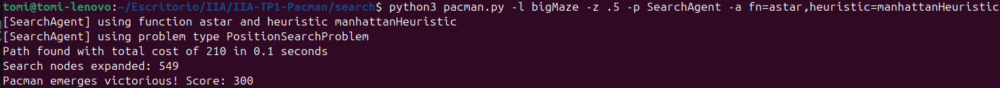

habría que explicar más o menos qué solución dimos y qué resultados obtuvimos

# Ejercicio 1

El algoritmo DFS busca los nodos más profundos del árbol de búsqueda sin expandir nodos ya visitados a partir de una instancia del problema de búsqueda.

Nuestra implementación lleva una **pila** de direcciones (el camino recorrido), una **pila** que contiene los nodos próximos a visitar (los sucesores de los nodos que visita) y un conjunto de estados ya visitados.

Siguiendo el algoritmo de búsqueda general, cuando visitamos un nodo chequeamos si es meta, en cuyo caso retornamos la lista de direcciones acumuladas. En caso contrario apilamos sus sucesores no visitados en la pila de nodos a visitar (es decir, los visitamos primero). Cada nodo recorrido es agregado al conjunto de nodos visitados y la dirección tomada para llegar a él es agregada a la pila del path. Cuando retrocedemos en el árbol (porque el camino tomado no nos lleva a nada) desapilamos tantas direcciones como diferencia haya entre el nivel del nodo actual y el tamaño de la pila, ya que el camino tiene exactamente un nodo por cada nivel. Por ejemplo, si llegamos al nivel 4 del árbol, la pila del path podría verse así:

path = ['N', 'N', 'E', 'S']

Si el siguiente nodo visitado es un nodo de nivel 2, ahora el path será:

path = ['N']

es decir, borramos el camino recorrido hasta volver al nivel 2, donde será pusheada la dirección tomada para llegar al nodo actual.

Los resultados obtenidos fueron los siguientes:

- Mapa tinyMaze: 16 nodos expandidos, costo 10
- Mapa mediumMaze: 146 nodos expandidos, costo 130
- Mapa bigMaze: 391 nodos expandidos, costo 212

# Ejercicio 2

El algoritmo BFS recorre el árbol de búsqueda por niveles a partir de una instancia del problema de búsqueda.

Nuestra implementación lleva una **cola** de pares (estado, **pila** del camino recorrido hasta el nodo) con los sucesores del nodo actual y un conjunto de estados ya visitados.

También siguiendo el algoritmo de búsqueda general, chequeamos si el nodo visitado es meta en cuyo caso devolvemos la lista asociada al camino del nodo. En caso contrario, agregamos los sucesores del nodo al final de la cola (siempre y cuando no hayan sido visitados previamente).

Los resultados obtenidos fueron los siguientes:

- Mapa mediumMaze: 269 nodos expandidos, costo 68
- Mapa bigMaze: 620 nodos expandidos, costo 210

# Ejercicio 3

La búsqueda de costo uniforme (UCS) expande el nodo de menor costo. También adaptando el algoritmo general de búsqueda, tomamos como base el algoritmo para BFS pero con la modificación de que la lista de sucesores es una **cola de prioridad**, donde la prioridad es el valor del costo acumulado hasta visitar el nodo.

Los resultados obtenidos fueron los siguientes:

- Mapa mediumMaze: 269 nodos expandidos, costo 68 
- Mapa mediumDottedMaze: 186 nodos expandidos, costo 1 
- Mapa mediumScaryMaze: 108 nodos expandidos, costo 68719479864

# Ejercicio 4

El algoritmo para la búsqueda A* es idéntico al de UCS, con la única diferencia de que al costo se le suma el valor de una **heurística** en el nodo.

Los resultados obtenidos fueron los siguientes:

- Mapa bigMaze: 549 nodos expandidos, costo 210

En el laberinto openMaze obtenemos estos resultados para distintas estrategias de búsqueda:

- A*: 535 nodos expandidos, costo 54
- UCS: 682 nodos expandidos, costo 54
- BFS: 682 nodos expandidos, costo 54
- DFS: 806 nodos expandidos, costo 298

Con alguna diferencia en la cantidad de nodos expandidos, los algoritmos A* con heurística distancia de Manhattan, UCS y BFS encuentran el camino óptimo. Por otro lado, DFS expande más nodos y encuentra un camino muy costoso por el hecho de aplicarse en un grafo muy grande. Como el mapa es muy abierto, tomando caminos largos logra encontrar la meta.

# Ejercicio 5

# Ejercicio 6

# Ejercicio 7

**FALTA HACER (LIBO :3)**